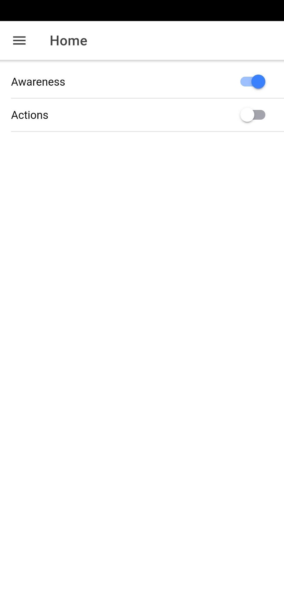
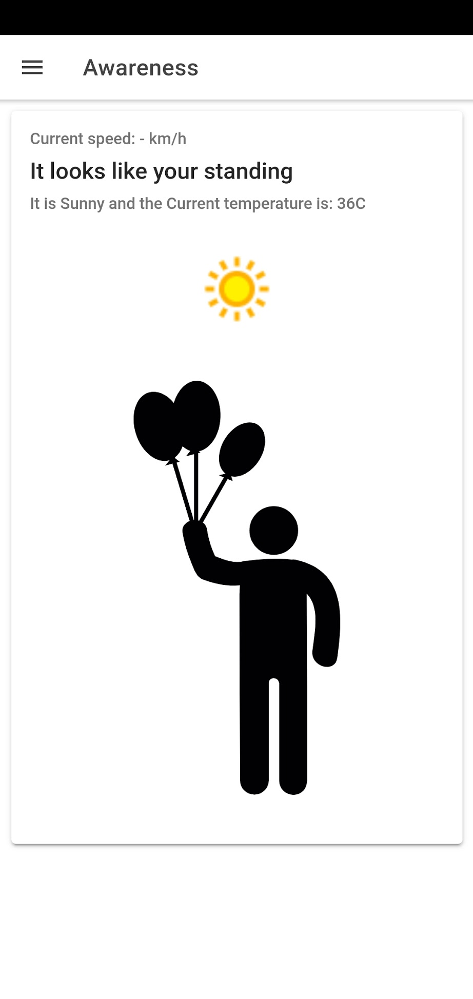
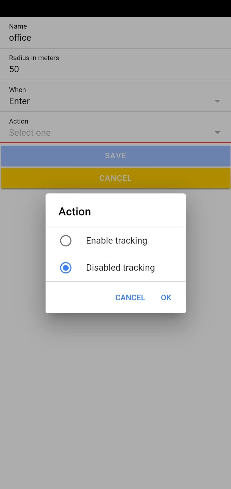
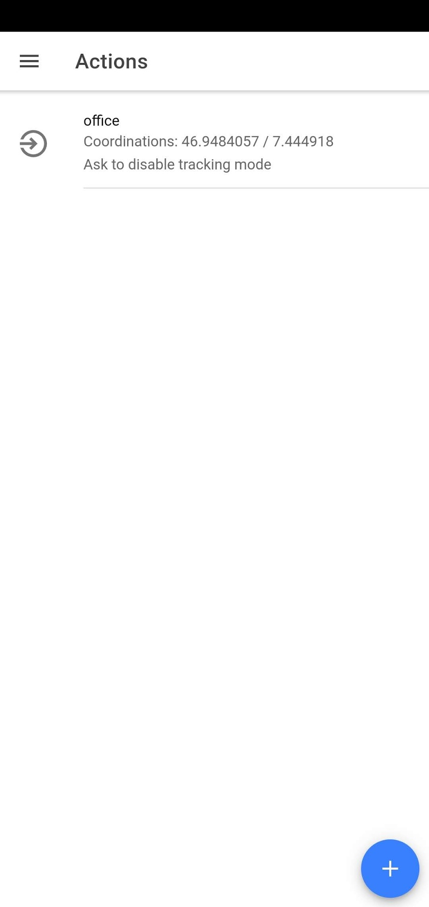

# AwarenessApp

## Install needed stuff
`npm i -g ionic`

`npm i -g cordova@8.1.2`

`npm i -g native-run`

## Downgrade Cordova (If already installed)
`npm uninstall -g cordova`

`npm install -g cordova@8.1.2`

## Run on android device
`ionic cordova platform add android`

`ionic cordova run android`

### Build apk
`ionic cordova build android`


## Debug in browser (Will not provide most native apis)
`ionic serve`

Start debugging from VS-Code with this config:
```json
{
    "name": "Attach to running android on device",
    "type": "cordova",
    "request": "attach",
    "platform": "android",
    "target": "device",
    "port": 9222,
    "sourceMaps": true,
    "cwd": "${workspaceRoot}"
}
```

# For developers
A short overview of the most important stuff in this project

## Awareness Service
Can be found here: [awareness.service.ts](./src/app/services/awareness.service.ts)

Contains: 
* Tracking of current speed
* Tracking of geofences
* Schedule notifications for geofences
* Decision making for current transportation type

## Weather Service
Can be found here: [weather.service.ts](./src/app/services/weather.service.ts)

Contains:
* Fetching of current weather condition from third-party service

Third-party service: https://api.apixu.com/v1/

## Public Transportation GeoService
Can be found here: [publictransportgeoinformation.service.ts](./src/app/services/publictransportgeoinformation.service.ts)

Contains:
* Swiss train grid in GeoJson format
* Calculation of current distance to public transportation routes

Data from: https://opendata.swiss/de/dataset/schienennetz

To have GeoJson, we converted the MapInfo Data with QGIS to GeoJson.
At the moment it is imported directly from the assets folder. A better solution would be a http backend service which has the data in a database and calculates the distance on request.


## Look and feel






